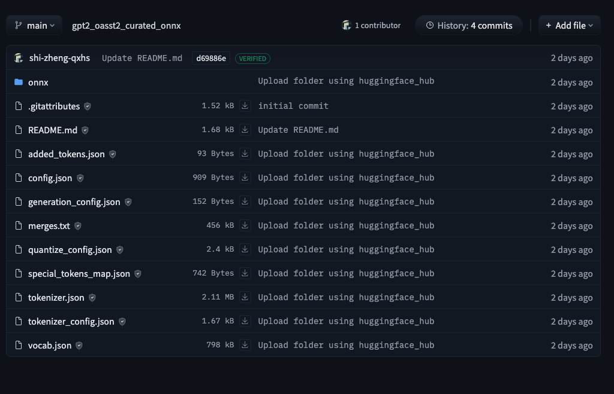

This repo demos a simple template of using [`transformers.js`](https://huggingface.co/docs/transformers.js/en/index) and [Deep Chat](https://deepchat.dev/) to create a demo chat.

[Live Demo](https://svelte-chat-slm.netlify.app/)

## download project

```bash
# clone git repository
git clone https://github.com/shizheng-rlfresh/slm-rag.git
# go to the directory and install dependency
npm install
```

## development mode

```bash
# start a serve on localhost
npm run dev -- --open

# build app
npm run build

# preview
npm run preview
```

## model options

-   To import transformers models through `transformers.js`, you will need a `.onnx` model, e.g., `model.onnx` (preferrably a quantized model, e.g., `model_quantized.onnx`).

    -   [`transformers.js`](https://huggingface.co/docs/transformers.js/en/custom_usage) recommends using the [`conversion script`](https://github.com/xenova/transformers.js/tree/main/scripts) to convert a customized model, e.g., your own pretrained or fine-tuned models.

    ```bash
    # create a python virtual environment
    python -m venv .venv
    # activate .venv and install required packages
    source .venv/bin/activate
    pip install -r requirements.txt
    # run the conversion script - <modelid>
    python -m scripts.convert --quantize --model_id <modelid>
    ```

    -   Push your custom model to hub and craft your huggingface repo files structures as follows, where your converted models are enclosed in `onnx` directory.
        

    -   In this demo, we used a [custom gpt2-small (124MM parms)](https://huggingface.co/shi-zheng-qxhs/gpt2_oasst2_curated_onnx) fine-tuned on a conversational dataset, i.e., [`oasst2`](https://huggingface.co/datasets/sablo/oasst2_curated). This model was fine-tuned on a NVIDIA Tesla T4 GPU for 20 epochs.

    ```javascript
    // import model from HuggingFace Hub
    import { pipeline } from '@xenova/transformers';
    const pipe = await pipeline('text-generation', 'shi-zheng-qxhs/gpt2_oasst2_curated_onnx');
    ```

    You can either use `pipeline` or `model.generate` as if using `transformers` in python.
    In [`index.js`](./src/lib/index.js), we used custom functions to process the user input and model generations, which can be modified based on your own need.

    -   [`Deep Chat`](https://deepchat.dev/) allows using `handler` in `request` to use models imported directly from `transformers.js`. [`chat.svelte`](./src/routes/chat.svelte) shows an example of how we handled custom functions, as well as using `requestInterceptor` and `responseInterceptor` to process the (user) input and (model generated) output.
